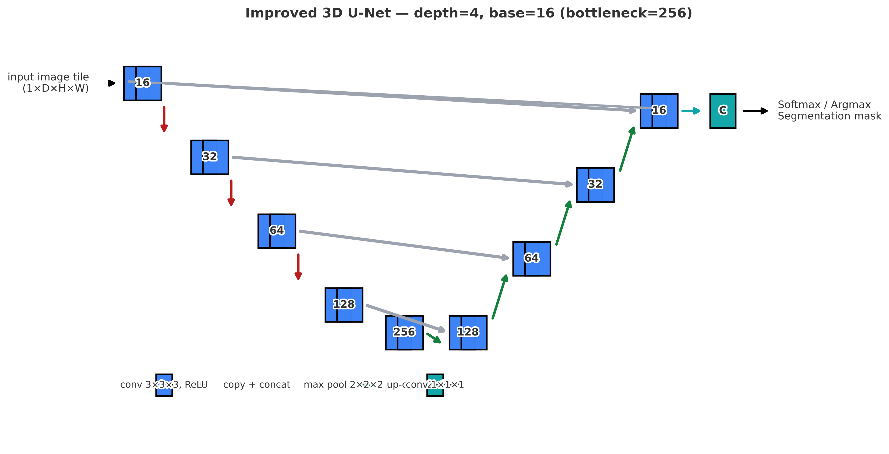
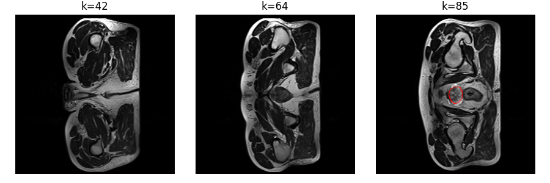
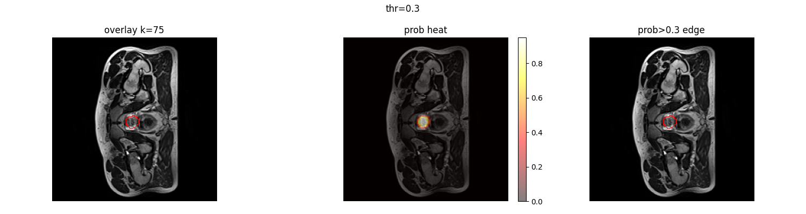
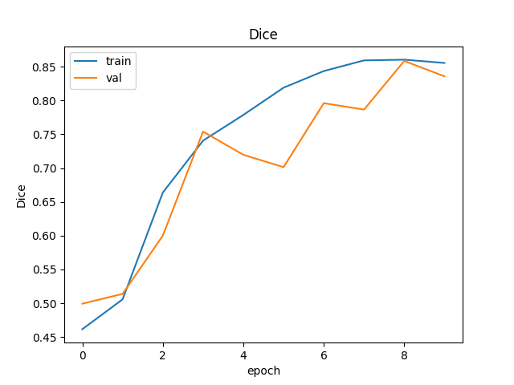
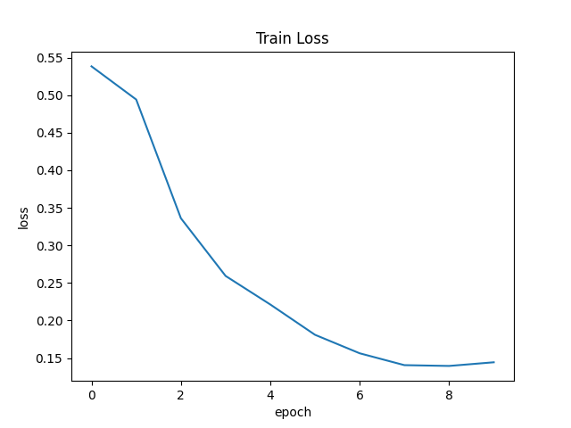
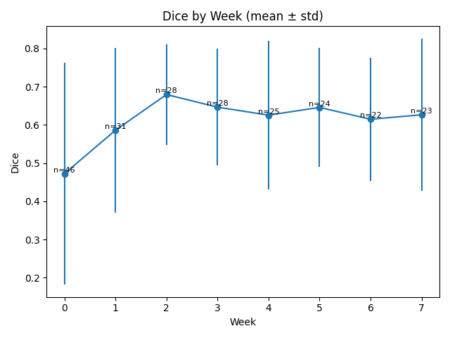
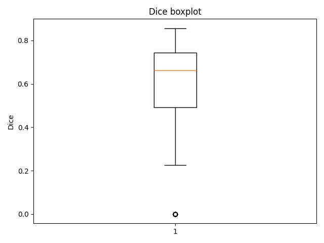
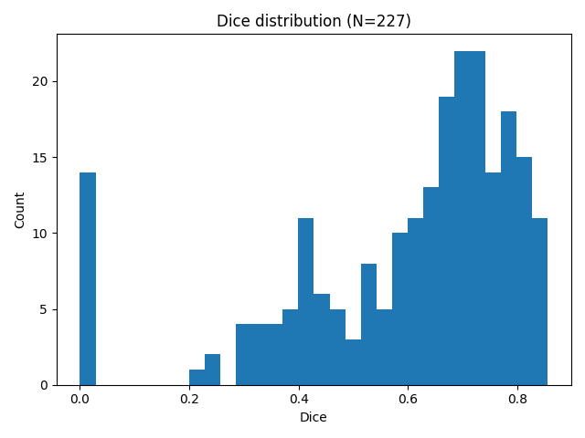

# 3D Prostate MRI Segmentation using Improved UNet
> COMP3710 — Pattern Analysis - Student: s47981739

### Problem & Approach
**Problem.** Accurate prostate delineation on MRI is essential for planning and monitoring therapy, yet manual annotation is time-consuming and variable across raters. We frame this as a 3D binary semantic segmentation task on the **HipMRI_Study_open** dataset.

**Approach.** We train an **Improved 3D U-Net** with encoder–decoder skips and deep supervision using a Dice-based loss. At inference we use **sliding-window** prediction (memory-safe), **test-time augmentation** (flip ensemble), and **largest connected component (LCC)** post-processing. Thresholds for foreground probability are **week-adaptive** to mitigate appearance shifts across treatment weeks.

### Data & Pre-processing
- **Images:** `semantic_MRs/*_LFOV.nii.gz`  
- **Labels:** `semantic_labels_only/*_SEMANTIC.nii.gz`  
- **Binary remap:** original class `5 → 1`, others `→ 0`.  
- **Normalisation:** intensity clipping to [0.5, 99.5] percentile within the non-zero mask, then z-score. *Rationale:* robust against outliers and coil bias; preserves relative tissue contrast.  
#### Geometry
- We do **not** resample images at inference.
- Predictions are saved as NIfTI masks in the **native affine** of each input volume (original orientation, voxel spacing, and origin).
- Sliding-window predictions are stitched back into the native grid.
- **Benefit:** avoids interpolation artefacts and keeps masks directly usable with clinical tools.

#### Split (justification)
- Dataset: **38 unique patients / 211 LFOV volumes**.
- We split **at the patient level** to prevent subject leakage: **26 / 6 / 6** patients for **train / val / test** (≈ **70/15/15**).
- Because weeks are imbalanced, we use **week-stratified sampling** so each split covers all weeks.
- Released lists: `splits/train.txt`, `splits/val.txt`, `splits/test.txt` (keys like `B006_Week0`).
- Verification: `count_dataset.py` confirms **0 patient overlap** across splits.

**Per-week distribution**

| Week | #Cases |
|----:|------:|
| W0 | 38 |
| W1 | 27 |
| W2 | 26 |
| W3 | 26 |
| W4 | 26 |
| W5 | 25 |
| W6 | 24 |
| W7 | 23 |

### Method & Architecture
<figure>
  
  <figcaption><b>Figure 1.</b> Improved 3D U-Net (depth=4, base=16). Blue: Conv3D(3×3×3)+ReLU; red: max-pool 2×2×2; green: up-conv 2×2×2; grey: copy & concat; teal: 1×1×1 head → <i>C</i> classes.</figcaption>
</figure>

**Backbone.** An improved 3D U-Net with residual ConvBlock3D (two Conv3D-BN-ReLU) and Squeeze-and-Excite (SE) channel attention inside each block.  
**Channels.** Encoder: `16 → 32 → 64 → 128`, **Bottleneck:** `256`, Decoder mirrors back to `16`, **Head:** `1×1×1` to `C` classes (binary in this project).  
**Regularisation.** Dropout3D `p=0.1` inside blocks; BatchNorm3d everywhere.  
**Objective.** `DiceLoss3D` (macro Dice over classes).

**Training.** Adam (lr `1e-3`), ReduceLROnPlateau (factor `0.5`, patience `5`), patient-wise splits (70/15/15), seeding set for determinism.

**Inference pipeline.**
- **Sliding window** prediction to avoid GPU OOM: `patch=96×128×128`, `stride=48×64×64`.
- **TTA** with flip ensemble (x/y/z), logits averaged before thresholding.
- **Post-processing:** **LCC** (largest connected component) to suppress small false positives.
- **Week-adaptive thresholding** on the foreground probability: **W0–1: 0.25**, **W2–4: 0.20**, **W5–7: 0.18** (selected on validation).

## Usage (reproducible commands)

## Dependencies
Tested with: Python 3.10+, PyTorch 2.x (CUDA 11/12), numpy, nibabel, scipy, scikit-image, tqdm, matplotlib

```bash
pip install -r requirements.txt
```

### Windows (PowerShell)
```powershell
python predict.py ^
  --image "YourDatasetROOT\HipMRI_Study_open\semantic_MRs\B006_Week0_LFOV.nii.gz" ^
  --weights ".\runs\hipmri3d_unet_bin\best.pt" ^
  --out_dir ".\Predict_Result\B006_Week0" ^
  --label_root "YourDatasetROOT\HipMRI_Study_open" ^
  --label_dir "semantic_labels_only" ^
  --binary_prostate --postprocess_lcc --save_nii --prob --metrics_csv ^
  --softmax_thr 0.20 --prob_class 1 ^
  --sw_enable --sw_patch "96,128,128" --sw_stride "48,64,64" ^
  --tta
```
### Linux/macOS (Bash)
```bash
python predict.py \
  --image "YourDatasetROOT/HipMRI_Study_open/semantic_MRs/B006_Week0_LFOV.nii.gz" \
  --weights "./runs/hipmri3d_unet_bin/best.pt" \
  --out_dir "./Predict_Result/B006_Week0" \
  --label_root "YourDatasetROOT/HipMRI_Study_open" --label_dir "semantic_labels_only" \
  --binary_prostate --postprocess_lcc --save_nii --prob --metrics_csv \
  --softmax_thr 0.20 --prob_class 1 \
  --sw_enable --sw_patch 96,128,128 --sw_stride 48,64,64 \
  --tta
```

## Qualitative examples

Below we show two representative cases with (i) a grid overview, (ii) a **threshold sweep** turning probabilities into a binary mask, and (iii) links to the raw NIfTI outputs.

### Case A — B006 Week0
- **Artifacts:** `example/B006_Week0_LFOV_prob.nii.gz` (probabilities), `example/B006_Week0_LFOV_pred.nii.gz` (binary), `example/B006_Week0_LFOV_meta.json` (native affine / spacing / shape).
- **Grid overview**  
  

**Threshold sweep (prob → mask)**

| thr = 0.20 | thr = 0.30 |
|:--:|:--:|
|  |  ||
| thr = 0.40 | thr = 0.50 |
| |  |

---

### Case B — B006 Week1
- **Artifacts:** `example/B006_Week1_LFOV_prob.nii.gz`, `example/B006_Week1_LFOV_pred.nii.gz`, `example/B006_Week1_LFOV_meta.json`.
- **Grid overview**  
  

**Threshold sweep (prob → mask)**

| thr = 0.20 | thr = 0.30 | 
|:--:|:--:|
|  |  | 
| thr = 0.40 | thr = 0.50 |
|  |  |

**How to read these panels.** Each panel overlays the predicted mask on the T2 image. As the probability threshold increases, the mask becomes more conservative (shrinks), which can reduce false positives but risks missing apex/base tissue. This motivates the **week-adaptive thresholds** used in our final pipeline (W0–1: 0.25, W2–4: 0.20, W5–7: 0.18).

**Reproduce this example**
```bash
# Windows PowerShell (paths are examples)
python predict.py ^
  --image "C:\COMP3710\HipMRI_Study_open\semantic_MRs\B006_Week0_LFOV.nii.gz" ^
  --weights ".\runs\hipmri3d_unet_bin\best.pt" ^
  --out_dir ".\example" ^
  --label_root "C:\COMP3710\HipMRI_Study_open" --label_dir "semantic_labels_only" ^
  --binary_prostate --save_nii --prob --postprocess_lcc --metrics_csv ^
  --sw_enable --sw_patch "96,128,128" --sw_stride "48,64,64" --tta ^
  --softmax_thr 0.20 --prob_class 1
```

## Experiment Setup (data → pre-processing → training → inference)
### Data
- **Input:** `semantic_MRs/*_LFOV.nii.gz`
- **GT:** `semantic_labels_only/*_SEMANTIC.nii.gz`
- **Binary remap:** original prostate class `5 → 1`, others `→ 0`.

### Pre-processing
- **Normalization:** clip to **[0.5, 99.5]** percentile (within non-zero region), then **z-score**.
- **Cropping:** none (LFOV used directly).
- **Geometry:** predictions are saved as NIfTI masks in the **native affine** of each input (original orientation, voxel spacing, origin). Sliding-window tiles are stitched back into the native grid.

### Model & Training
- **Backbone:** Improved **3D U-Net** (residual Conv3D×2 + **SE** channel attention).  
  **Channels:** encoder `16→32→64→128`, **bottleneck=256**, decoder mirrors back to `16`; head `1×1×1 → C` (binary here).
- **Loss:** DiceLoss (binary mode)  
- **Optimizer:** Adam (`lr=1e-3`)  
- **Scheduler:** ReduceLROnPlateau (factor `0.5`, patience `5`)  
- **Epochs:** converged in the last ~10 epochs (see curves)  
- **Final checkpoint used:** `runs/hipmri3d_unet_bin/best.pt`

<figure>
  
  <figcaption><b>Figure.</b> Network schematic. Blue=Conv3D(3×3×3)+ReLU; red=max-pool 2×2×2; green=up-conv 2×2×2; grey=copy&concat; teal=1×1×1 head → <i>C</i>.</figcaption>
</figure>

**Training curves**
| Dice over epochs | Loss over epochs |
|:--:|:--:|
|  |  |

### Inference pipeline
- **Sliding-window** to avoid OOM: `patch=96×128×128`, `stride=48×64×64`.
- **TTA:** flip ensemble (x/y/z), logits averaged.
- **Post-processing:** **Largest Connected Component (LCC)** to suppress small FP islands.
- **Week-adaptive thresholds** (foreground prob.): **W0–1: 0.25**, **W2–4: 0.20**, **W5–7: 0.18** (chosen on validation).

---

## Results (baseline)

**Overall Dice (no SW/TTA):** `0.577 ± 0.229` on **422** cases.

### Visual summaries

| Dice by week | Box plot (all cases) | Histogram (all cases) |
|:--:|:--:|:--:|
|  |  |  |

**Reading guide.**
- *Dice by week* shows how performance varies across treatment weeks.
- *Box plot* summarizes overall dispersion and outliers.
- *Histogram* shows the distribution shape across all test cases.

> **Note.** The above is a **baseline without** sliding-window + TTA. The full inference pipeline (**SW + TTA + LCC + week-adaptive thresholds**) is used for the final submission and is expected to improve the aggregate Dice.

### Planned ablations (reported on a held-out subset)
- + Sliding window (patch `96×128×128`, stride `48×64×64`)
- + Sliding window + TTA (flip x/y/z; logit averaging)
- + Sliding window + TTA + LCC
- + Week-adaptive thresholds (W0–1: 0.25, W2–4: 0.20, W5–7: 0.18)

## Troubleshooting
- **CUDA out of memory** → enable `--sw_enable` and reduce `--sw_patch` / increase `--sw_stride`.
- **[DiceLoss3D] label value >= num_classes** → set `--classes` correctly **or** enable `--binary_prostate --prostate_label 5`.
- **Weird geometry/orientation** → we save masks in **native affine**; verify with the same viewer as inputs.
- **Slow inference** → disable TTA, or reduce patch size/overlap; keep LCC.

## References & Acknowledgements
- Ronneberger O. et al., U-Net: Convolutional Networks for Biomedical Image Segmentation.
- PyTorch & scientific Python ecosystem.
- **AI assistance disclosure:** ChatGPT/GitHub Copilot were used for wording and minor debugging; modelling choices and final decisions are my own. (Aligned with UQ guidance on acknowledging generative AI.)